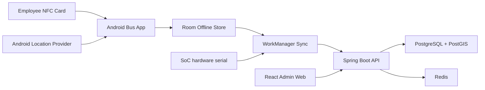

# Architecture

## Runtime View



All bus devices run the same APK and use one deployment API key. Each request
also sends `X-Device-Hardware-Serial`; the backend resolves the unique Device
row and its assigned Bus before processing the request. The serial identifies
the unit but is not treated as an authentication secret.

## Source Layout

```text
.
|-- apps/
|   |-- android-bus/
|   `-- admin-web/
|-- services/
|   `-- backend/
|-- contracts/
|-- docs/
`-- infra/
    |-- local/
    `-- migrations/
```

## Contract Ownership

The backend OpenAPI definition will be the transport-contract source of truth.
It will be added only after the database concepts and externally visible fields
are approved.

After approval:

1. Flyway migrations define persistence.
2. Backend domain models map approved business concepts.
3. OpenAPI defines external request and response formats.
4. Admin Web types are generated from OpenAPI.
5. Android models are generated from OpenAPI where practical, with separate
   Room entities for local synchronization state.

Database rows and API payloads do not need to be identical. Internal fields,
spatial storage details, audit columns, and security data should not leak into
client contracts.

## Integration Strategy

Keep the initial system as a modular monolith. A future car booking system can
integrate by:

- Reusing the employee identity reference.
- Reusing fleet vehicles where bus is a vehicle category.
- Keeping tracking as a dedicated domain module.
- Keeping boarding eligibility separate from booking eligibility.
- Publishing stable API or domain events only when an actual integration need
  is known.
