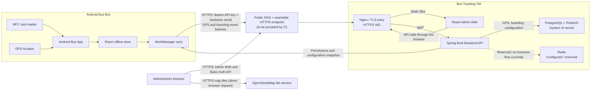

# Bus Tracking IT Response and Service Flow

## Email reply draft

Hi Tien,

Thank you for providing the server information.

1. Could you please help create a public DNS name for the Bus Tracking service
   and make the HTTPS endpoint reachable by the Android bus devices? The public
   DNS should resolve to the approved external entry point for the VM (or its
   NAT/reverse-proxy endpoint). Please also advise which public DNS name and TLS
   certificate will be provided. Only HTTPS port 443 needs to be exposed for
   application traffic; PostgreSQL and Redis must remain private.

2. The Android application authenticates its Backend API requests using a
   deployment API key in the `Authorization: Bearer <API key>` header. Each
   request also includes `X-Device-Hardware-Serial`. The Backend validates both
   the API key and that the hardware serial belongs to an active registered
   device and an active bus. The hardware serial identifies the device but is
   not treated as a secret.

3. Please find the Bus Tracking service architecture and data flow below and
   in the accompanying SVG diagram.

One network clarification: the current Admin Web implementation loads
OpenStreetMap tiles directly from the administrator's browser. Therefore, the
admin client network must be able to access
`https://{s}.tile.openstreetmap.org`. VM outbound access alone will not cover
this browser-to-OpenStreetMap flow unless a map-tile proxy is introduced later.

Thanks & Best Regards,

Cliff

## Service architecture and data flow

## Flow summary

1. The Android Bus App captures GPS positions and NFC boarding events.
2. Data and authorization snapshots are stored locally in Room so boarding can
   continue temporarily when connectivity is unavailable.
3. WorkManager synchronizes with `/api/device/v1/` over HTTPS. Every request
   carries the shared deployment API key and the device hardware serial.
4. The Backend validates the API key, registered device, assigned bus, and
   active state before accepting the request.
5. GPS points, boarding events, buses, routes, stops, employees, and permissions
   are persisted in PostgreSQL/PostGIS.
6. The Backend returns the latest route, stop, and employee permission snapshot
   to the Android device for local authorization.
7. Administrators access the React Admin Web through Nginx and use the Backend
   Admin API with HTTP Basic authentication.
8. The administrator's browser downloads OpenStreetMap tiles directly from the
   OpenStreetMap tile servers.

## Accuracy notes

- The API key is currently shared by the Android deployment; it is not a
  per-device key.
- The hardware serial is an additional device identity check, not an additional
  secret.
- Redis is configured in the runtime topology but the current application code
  does not use it for an implemented business data flow.
- A DNS record alone does not provide Internet reachability. IT may also need
  to provide routing/NAT, firewall access, and a TLS certificate for HTTPS 443.
